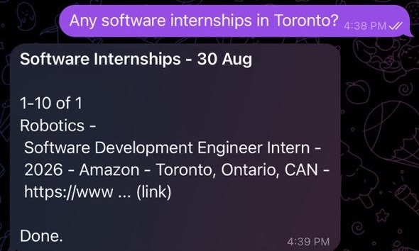
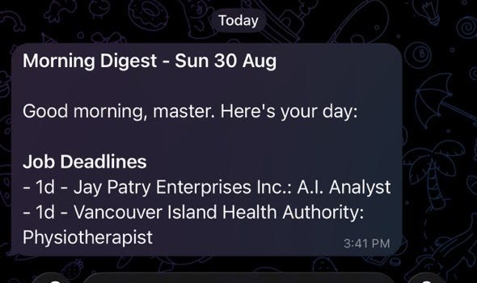
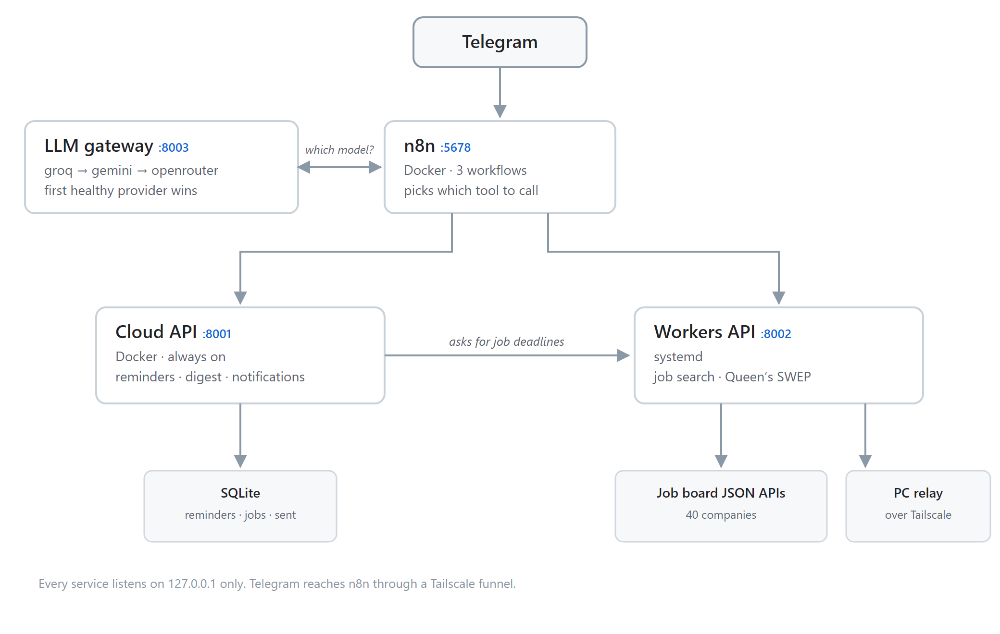

# Personal Agent System

A Telegram bot that hunts for internships across 40 companies and nags me about
deadlines. It lives on a free Oracle Cloud server and runs on free LLM API tiers,
so keeping it online costs me about nothing.

## Overview

I message it in plain English. An AI agent works out which tool answers the
question, calls that tool over HTTP, and writes the answer back.

<p align="center">
  
</p>
<p align="center">
  
  
</p>

## Architecture

<picture>
  <source media="(prefers-color-scheme: dark)" srcset="docs/architecture-dark.png">
  
</picture>

n8n is the part that decides what happens. It runs three workflows: the main
agent, a reminder bot that replies in plain JSON instead of using tool calls, and
an error handler that turns crashes into messages I can actually read.

n8n sits inside Docker and can't run scripts on the machine itself, so every
worker is put behind an HTTP endpoint instead. That turned out to be the better
setup anyway, because each endpoint is then just a tool the agent can call.

### Deployment

The server is an Ubuntu 22.04 ARM box on Oracle's free tier. n8n and the Cloud
API run in Docker; the Workers API and the LLM gateway are systemd units, so they
come back after a reboot. A health script runs on cron every two hours.
`~/personal-agent` on the server is a clone of this repo, so deploying is a push,
a pull and a restart.

Telegram needs a public HTTPS address to deliver messages, which it gets through
a Tailscale funnel. Everything else listens on `127.0.0.1` only — the containers
share the host's network, so binding to `0.0.0.0` would put these APIs straight
on the server's public IP with only a firewall in the way.

## What it does

- Searches Greenhouse, Lever, Ashby and Workday boards across 36 companies, plus
  the Amazon, Oracle, Microsoft and RBC career sites, filtered by keywords,
  intern-only and location
- Gives every posting a key like `greenhouse:12345` and checks it against SQLite
  first, so the same job never shows up twice
- Handles four kinds of reminder: one-off, daily, weekly on set days, and
  deadlines that start appearing a chosen number of days early
- Crosses a task out in the message already on my phone when I tick it off,
  instead of sending a second notification
- Sends one morning digest with the day's to-dos and any job deadlines coming up
- Falls back to another model provider when one runs out of free quota
- Watches its own disk, memory, services, containers and ports, and messages me
  when something looks wrong

## Workers API

FastAPI on `:8002`, run by systemd. It handles job search and saves what it finds
to SQLite. Postings come from public JSON endpoints rather than scraped web pages,
so a site redesign doesn't break anything.

`jobs_worker.py` covers the four board platforms and `direct_boards.py` the four
company career sites. `job_store.py` does the saving, the duplicate checking and
hiding jobs I don't want to see, `matching.py` filters by role and location, and
`dates.py` sorts out posted dates, since every site writes them differently.

Queen's University's co-op portal blocks traffic from data centres, so the server
can't reach it at all. A small program on my home PC does that one scrape and
sends the results back over Tailscale. That relay isn't in this repo, so
everything here works apart from the Queen's search.

## Cloud API

FastAPI on `:8001`, running in Docker. Reminders, the digest, and keeping track of
what's been sent.

`reminders_worker.py` is what decides when things fire. `sent_store.py` remembers
which messages went out, so finishing a task later can edit the original —
Telegram only lets a bot edit its own messages for 48 hours, so anything older
gets cleared out. The digest builds the to-do part itself and asks the Workers API
for job deadlines.

## LLM Gateway

A proxy on `:8003` that looks like the OpenAI API. n8n's agent node only accepts
one model, so there's no way to set up backups inside the workflow without
rebuilding every tool for every provider. The gateway handles it instead: it tries
providers in order, free and fastest first, and if one hits its rate limit that
one goes on a timer while the next takes over. They all speak the same format, so
tool calls pass straight through.

## Getting Started

You'll need a Linux machine with Docker and Python 3.10 or newer, at least one LLM
provider key (Groq, Gemini or OpenRouter), and a Telegram bot token from
@BotFather along with the chat ID to send to.

```bash
git clone https://github.com/cooplaxx73/personal-agent-system.git
cd personal-agent-system
cp .env.example secrets.env
chmod 600 secrets.env
```

Start n8n and the Cloud API:

```bash
docker compose up -d
```

Then the Workers API and the gateway:

```bash
python -m venv workers-venv
./workers-venv/bin/pip install -r app/requirements.txt
./workers-venv/bin/python -m playwright install chromium
./workers-venv/bin/uvicorn app.api:app --host 127.0.0.1 --port 8002
```

The Playwright line downloads an actual browser, which pip doesn't do on its own,
and it's only needed for the Queen's scrape. The gateway starts the same way from
`app.llm_gateway:app` on `:8003`. Then schedule the health script:

```
0 */2 * * * /home/ubuntu/personal-agent/vm_watchdog.sh >/dev/null 2>&1
```

The three workflows are in `n8n/`, exported with my chat ID and account name
swapped for placeholders. Import them, create the Telegram credential, replace
`YOUR_TELEGRAM_CHAT_ID` in the Telegram nodes, and point the model node at
`http://127.0.0.1:8003/v1` as an OpenAI-style endpoint.

## API Endpoints

Jobs, on the Workers API:

```
GET  /run/jobs                     search every job board
GET  /jobs/query                   look through saved postings
GET  /jobs/dismiss                 hide postings matching a word
GET  /jobs/unhide                  bring hidden postings back
GET  /run/job_deadline_reminders   postings with a deadline coming up
GET  /run/queens                   run the Queen's scrape directly
GET  /jobs/queens                  Queen's search through the home PC
GET  /health                       simple up check, used by the watchdog
```

Reminders, on the Cloud API:

```
GET  /reminders/add        add a one-off, daily, weekly or deadline reminder
GET  /reminders/list       everything still active
GET  /reminders/complete   tick it off and cross it out in the sent message
GET  /reminders/delete     remove one
GET  /reminders/purge      clear out anything three or more days past
GET  /reminders/due        what's firing right now, checked every minute
GET  /reminders/digest     the finished morning message
POST /reminders/act        the JSON interface the reminder bot uses
GET  /notify/record        save a sent message so it can be edited later
```

And the model gateway:

```
POST /v1/chat/completions   OpenAI-style, with backup providers
GET  /v1/models             which models it offers
GET  /status                which providers are up and which are on a timer
GET  /health                simple up check
```

## Limitations

There are no tests. I check it by running it, which is the next thing to fix.

Every endpoint is a GET, including the ones that change data like
`/reminders/add` and `/jobs/dismiss`. That isn't how HTTP is meant to work, since
anything can safely retry a GET. I did it because n8n's tooling is far simpler
with GET and query parameters, and nothing outside the machine can reach these
ports anyway. It's the first thing I'd change if either of those stopped being
true.

There's no login on any of the internal APIs either. It's built for one person,
and keeping everything on localhost is the whole security setup.

The Queen's scraper is a first draft. Its page selectors were never checked
against the real site, and it needs a second machine switched on. Microsoft's
career site blocks it fairly often, so that source returns nothing instead of
erroring out — one flaky site shouldn't take down a whole search.

## License

MIT
